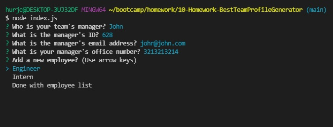
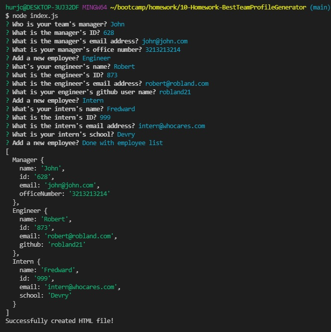
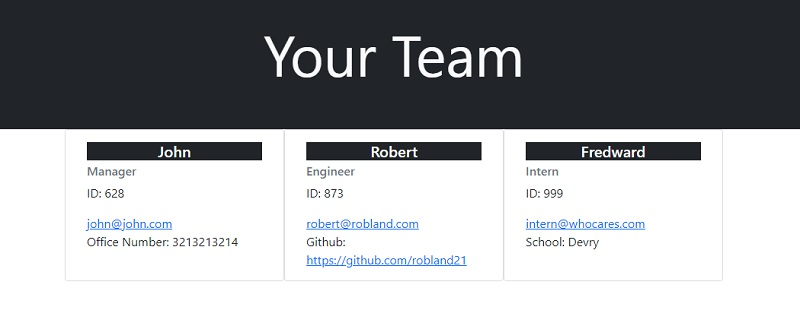

# Best Team Profile Generator

  ## Description
  I made a Team Profile Generator.

  To start the generator, run the index.js on node. The user will prompted with questions. After the user has completed answering the prompts, An HTML file will be made in the "dist" folder.

  When the application is started, the user is presented with prompts regarding the team's manager. The prompts will ask questions and gather information on the manager's name, id, email, and office number. These information and the "Manager" role will be added to the manager's card which will be added to the HTML file.

  After completing the prompts for the manager, the user is asked if they would like to add another position, and they are presented with the choices: "Engineer", "Intern", and "Done with employee list". This prompt will be brought up after entering information for any role.

  When "Engineer" is chosen, prompts about the team's engineer will be presented. The prompts will ask questions and gather information on the engineer's name, id, email, and github user name. These information will be added to the engineer's card which will be added to HTML file.

  When "Intern" is chosen, prompts about the team's intern will be presented. The prompts will ask questions and gather information on the intern's name, id, email, and school. These information will be added to the intern's card which will be added to HTML file.

  Error handling has been added to prompts to ensure valid responses.

  When "Done with employee list" is chosen, the HTML file is made using the information the application has gathered from the prompts.

  Enjoy.

  GitHub Repository: [https://github.com/jhur628/10-Homework-BestTeamProfileGenerator](https://github.com/jhur628/10-Homework-BestTeamProfileGenerator)
  
  Sample HTML file: [https://github.com/jhur628/10-Homework-BestTeamProfileGenerator/blob/main/dist/team.html](https://github.com/jhur628/10-Homework-BestTeamProfileGenerator/blob/main/dist/team.html)
  
  Video: [https://watch.screencastify.com/v/rAzB2Sfs2dxVuHASGgGX](https://watch.screencastify.com/v/rAzB2Sfs2dxVuHASGgGX)
  
  ## Table of Contents
  ### [Installation](#Installation)
  ### [Usage](#Usage)
  ### [Credits](#Credits)
  ### [Questions](#Questions)
  ### [Screenshots](#Screenshots)

  ## Installation
  No installation required. Just run index.js on node.
  ## Usage
  This application will create an HTML file with your team's information. The user just to needs to fill in the prompts and a HTML file will generate.
  ## Credits
  I had some help from my peers, once again, while participating in a study group. A BIG THANK YOU TO THEM!
  ## Questions
  Have any questions?  
  Contact me at hur.john628.com.  
  Github: https://github.com/jhur628/  
  ## Screenshots
    
    
  